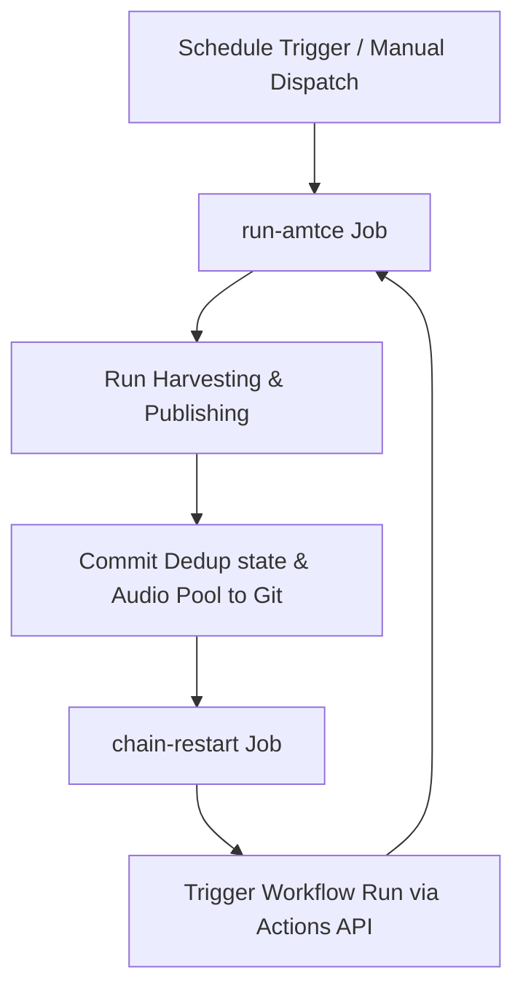

# 🚀 Running AMTCE 24/7 on GitHub Actions

This guide explains how to set up, configure, and monitor the automated self-healing 24/7 run cycle of the **Automated Media to Content Engine (AMTCE)** on GitHub.

---

## 🛠️ GitHub Actions Secrets Configuration

To run the engine without hardcoding credentials in the repository, you must add your configuration files and keys as **GitHub Actions Secrets**.

### Step 1: Navigate to Secrets Settings
1. Go to your GitHub Repository: `swargawasal/AMTCE-Autonomous-Multimedia-Transformation-Compilation-Engine`.
2. Click **Settings** (top navigation bar).
3. In the left sidebar, expand **Secrets and variables** and click **Actions**.
4. Click **New repository secret**.

### Step 2: Add Secrets
Configure the following secrets based on your active channels and configurations:

| Secret Name | Description / What to Paste |
| :--- | :--- |
| **`ENV_FILE_CONTENT`** | **[Required]** Paste the entire content of your local `Credentials/.env` file. This contains all pipeline modes, API configurations, and folder targets. |
| **`TELEGRAM_CONFIG_JSON`** | Paste the JSON content of your `Credentials/telegram_config.json` containing group/chat IDs. |
| **`META_CONFIG_JSON`** | Paste the Instagram session cookies/config JSON for the **General Fallback** account. |
| **`META_CONFIG_JSON_FASHION`** | Paste the Instagram config JSON for the **Fashion** account. |
| **`CLIENT_SECRET_JSON`** | Paste the Google YouTube API `client_secret.json` for the **Fashion** account. |
| **`TOKEN_JSON`** | Paste the Google YouTube API OAuth `token.json` for the **Fashion** account. |
| **`META_CONFIG_JSON_NSFW`** | Paste the Instagram config JSON for the **NSFW** account. |
| **`CLIENT_SECRET_JSON_ADULT`** | Paste the Google YouTube API `client_secret.json` for the **NSFW** account. |
| **`TOKEN_JSON_ADULT`** | Paste the Google YouTube API OAuth `token.json` for the **NSFW** account. |
| **`UPI_ID`** | Paste the UPI payment ID for the Hotness Poll settlement. |

---

## 🔄 How the 24/7 Cycle Works

AMTCE achieves 24/7 continuous operation using a **Chain-Restart Workflow Loop**:

1. **`run-amtce` Job**: Runs the main Python script (`main.py`). It scrapes clips, compiles them with voiceovers and music, and publishes them.
2. **State Persistence**: Before the job exits, it commits modified JSON files (dedup database, audio usage indexes, and extracted audio pools) back to the repository. This ensures no duplicate clips are processed next time.
3. **`chain-restart` Job**: Runs after the main job finishes. It uses the GitHub Actions API to trigger the next execution of `amtce-runner.yml`, creating an infinite loop.

---

## 🚦 Manual Control & Monitoring

### Starting the Loop
1. Navigate to the **Actions** tab of your repository.
2. Under "Workflows" in the left sidebar, click on **AMTCE Runner**.
3. Click the **Run workflow** dropdown on the right.
4. Select the run mode (`both`, `harvest`, or `publish`) and click **Run workflow**.

### Stopping the Loop
If you need to update configurations locally or halt execution:
1. Navigate to the **Actions** tab of your repository.
2. Find the currently running workflow run and click on it.
3. Click the **Cancel run** button at the top right.
